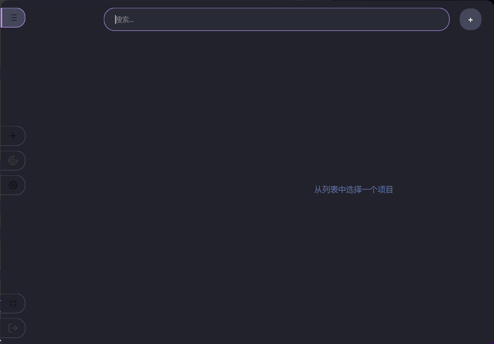

# Oracipher

Oracipher 是一款基于 Python 和 PyQt6 构建的现代化桌面密码管理器。它秉承**安全第一**和**数据本地化**的核心原则，为用户提供一个完全在自己掌控之下的密码保险库。所有数据都经过业界领先的加密算法在本地设备上加密，您的主密码是唯一密钥，它绝不会被存储或传输。

<p align="center">
    </a>
</p>

---

## ✨ 核心特性

*   **🛡️ 零知识安全架构**: 您的主密码是您数据的唯一钥匙，我们无法访问、查看或恢复它。
*   **🔒 行业标准加密**:
    *   使用 **Argon2id** 算法派生加密密钥，有效抵御暴力破解攻击。
    *   使用 **AES-256-GCM** 对所有数据进行认证加密，确保数据的机密性和完整性。
*   **💻 完全本地存储**: 您的所有加密数据都只存储在您自己的电脑上，没有任何云端服务器参与。
*   **🔑 TOTP (2FA) 支持**: 可为条目设置和生成基于时间的一次性密码 (TOTP)，增强账户安全性。
*   **🔄 安全的数据导入/导出**:
    *   支持导出为使用主密码加密的 `.skey` 安全备份文件。
    *   支持从 Google Chrome, Samsung Pass 等主流服务导出的文件进行导入。
    *   提供明文 CSV 导出选项，并附有强烈的安全警告。
*   **🎨 可定制的主题**: 内置精心设计的亮色 (Lumina Glow) 和暗色 (Dracula Dark) 主题。
*   **🌐 多语言支持**: 目前支持简体中文和英语，并可轻松扩展。
*   **🚀 现代化流畅UI**: 基于 PyQt6 构建，界面美观、响应迅速，并包含流畅的动画效果。

---

## 📸 软件截图

| 亮色主题 (Lumina Glow) | 暗色主题 (Dracula Dark) |
| :----------------------------------------------------------: | :-----------------------------------------------------------: |
|  |  |


---

## 🛠️ 技术栈与依赖

*   **核心框架**: [PyQt6](https://www.riverbankcomputing.com/software/pyqt/)
*   **加密库**: [cryptography](https://cryptography.io/), [argon2-cffi](https://argon2-cffi.readthedocs.io/)
*   **二维码处理**: [pyzbar](https://pypi.org/project/pyzbar/), [Pillow](https://python-pillow.org/)
*   **数据库**: `sqlite3` (Python 内置)
*   **环境配置**: `python-dotenv`
*   **打包工具**: [PyInstaller](https://pyinstaller.org/)

---

## 🏛️ 核心概念与架构

本应用采用接近 **模型-视图-控制器 (MVC)** 的设计模式，实现了业务逻辑与用户界面的高度解耦。

*   **模型 (Model)**: 位于 `/core` 目录。负责所有核心业务逻辑，包括加密解密 (`crypto.py`)、数据库交互 (`database.py`) 以及数据的导入导出处理 (`data_handler.py`)。这一层不依赖任何 UI 组件。

*   **视图 (View)**: 位于 `/ui/views`, `/ui/dialogs`, `/ui/components` 目录。负责所有 UI 元素的渲染和布局，它们是“哑”组件，只负责展示数据和发送用户操作信号（如点击）。

*   **控制器 (Controller/Logic)**: 位于 `/ui/controllers` 和 `/ui/logic` 目录。作为视图和模型之间的桥梁，它接收来自视图的信号，调用模型处理数据，然后将结果返回给视图进行更新。`main_window_controller.py` 是整个应用 UI 逻辑的核心。

*   **异步任务管理**: 为了防止因耗时操作（如数据库读写、密码验证、网络请求）导致界面卡顿，应用实现了一个全局的 `TaskManager` (`/ui/task_manager.py`)。它使用 `QThread` 将耗时任务放到后台线程执行，并通过信号与主线程安全通信，确保了 UI 的流畅性。

---

## 📁 项目文件结构解析

```
.
├── config.py               # 应用程序配置，如数据路径、设置文件管理
├── core/                   # 核心业务逻辑模块
│   ├── crypto.py           # 封装所有加密、解密、密钥派生操作
│   ├── database.py         # 数据库管理器 (SQLite)，负责所有CRUD操作
│   ├── data_handler.py     # 处理数据的导入和导出逻辑
│   ├── icon_fetcher.py     # 从网络URL抓取网站图标
│   ├── icon_processor.py   # 图标处理（如圆形裁剪）
│   └── importers/          # 各种导入格式的解析器
├── images/                 # 存放应用图标、截图等静态图片
├── language/               # 国际化模块
│   ├── manager.py          # 语言管理器，提供全局翻译接口 `t`
│   └── locales/            # 存放具体的语言翻译文件 (en.py, zh_CN.py)
├── main.py                 # 应用程序主入口
├── requirements.txt        # 项目依赖列表
├── Oracipher.spec          # PyInstaller 打包配置文件
├── ui/                     # 所有用户界面相关代码
│   ├── assets/             # QSS样式表、UI图标等静态资源
│   ├── components/         # 可复用的自定义UI小部件
│   │   ├── animated_bookmark_button.py # 带动画的侧边栏按钮
│   │   ├── custom_widgets.py # 带自定义样式的控件 (如滚动条)
│   │   ├── two_fa_widget.py  # 显示和刷新TOTP代码的控件
│   │   └── ...
│   ├── controllers/        # UI 控制器
│   │   ├── main_window_controller.py # 主窗口的“大脑”，连接UI和核心逻辑
│   │   └── data_io_controller.py # 专门处理导入/导出流程的控制器
│   ├── dialogs/            # 各种对话框窗口
│   │   ├── add_edit_dialog.py # 添加/编辑条目的对话框
│   │   ├── settings_dialog.py # 设置对话框
│   │   └── ...
│   ├── logic/              # 对话框内部的复杂逻辑管理器
│   │   ├── icon_manager.py   # 管理添加/编辑对话框中的图标逻辑
│   │   └── two_fa_manager.py # 管理添加/编辑对话框中的2FA逻辑
│   ├── views/              # 主要的UI视图组件
│   │   ├── sidebar_view.py   # 侧边栏视图
│   │   ├── main_content_view.py # 主内容区视图（条目列表+详情）
│   │   └── details_view.py   # 条目详情显示视图
│   ├── theme_manager.py    # 主题管理器，负责加载和应用QSS样式
│   └── task_manager.py     # 异步任务管理器
├── utils/                  # 通用工具模块
│   ├── clipboard.py        # 安全剪贴板管理器
│   ├── icon_cache.py       # 图标缓存，避免UI卡顿
│   └── paths.py            # 资源路径处理，兼容开发和打包环境
└── ...
```

---

## 🚀 本地运行指南

**前提**: 已安装 Python 3.8+

1.  **克隆仓库**
    ```bash
    git clone <your-repository-url>
    cd Oracipher
    ```

2.  **创建并激活虚拟环境**
    ```bash
    # Windows
    python -m venv venv
    .\venv\Scripts\activate

    # macOS / Linux
    python3 -m venv venv
    source venv/bin/activate
    ```

3.  **安装项目依赖**
    *   首先，您需要生成 `requirements.txt` 文件。如果您已经安装了所有依赖，可以运行：
        ```bash
        pip freeze > requirements.txt
        ``` 
        *   然后，其他人可以通过以下命令安装：
        ```bash
        pip install -r requirements.txt
        ```

4.  **运行应用**
    ```bash
    python main.py
    ```

---

## 📦 打包为可执行文件

本项目使用 **PyInstaller** 进行打包。项目内已包含一个经过优化的 `Oracipher.spec` 配置文件。

1.  **准备打包图标**
    *   确保在 `/images` 目录下有一个名为 `logo.ico` 的Windows图标文件。您可以使用在线工具从 `icon-256.png` 转换得到。

2.  **安装 PyInstaller**
    ```bash
    pip install pyinstaller
    ```

3.  **执行打包**
    在项目根目录下打开终端，运行以下命令：
    ```bash
    pyinstaller Oracipher.spec
    ```

4.  **查找结果**
    打包成功后，所有文件将位于 `/dist/Oracipher` 文件夹下。您可以将整个文件夹分发给用户，或将其压缩。

---

## 🤝 贡献代码

欢迎您为 Oracipher 做出贡献！如果您发现了 bug 或有新的功能建议，请随时提交一个 [Issue](<your-repo-issues-link>)。如果您想贡献代码，请遵循以下步骤：

1.  Fork 本仓库。
2.  创建一个新的分支 (`git checkout -b feature/AmazingFeature`)。
3.  提交您的更改 (`git commit -m 'Add some AmazingFeature'`)。
4.  将您的分支推送到远程仓库 (`git push origin feature/AmazingFeature`)。
5.  提交一个 Pull Request。

---

## 📄 许可证

本项目采用 [MIT 许可证](LICENSE.md) 进行授权。

---

## 📫 联系方式

开发者: [eldric] - [eldric520lol@gmail.com](mailto:eldric520lol@gmail.com)

项目链接: [https://github.com/EldricArlo/Oracipher/tree/10.8.0-version](https://github.com/EldricArlo/Oracipher/tree/10.8.0-version)
