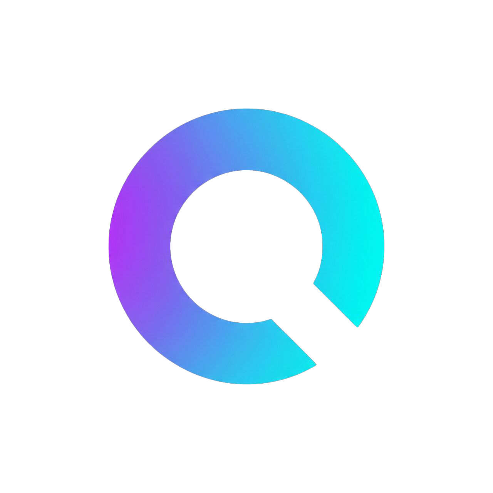
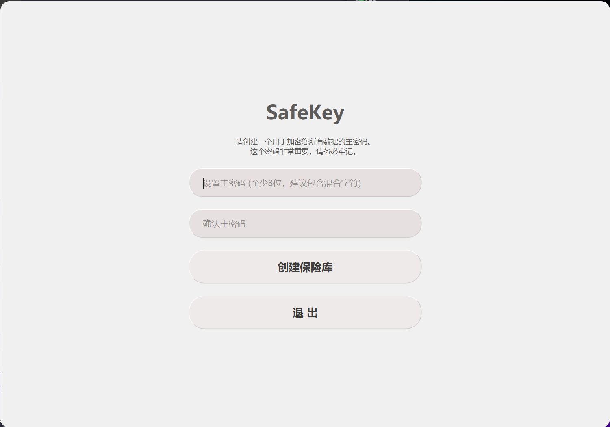
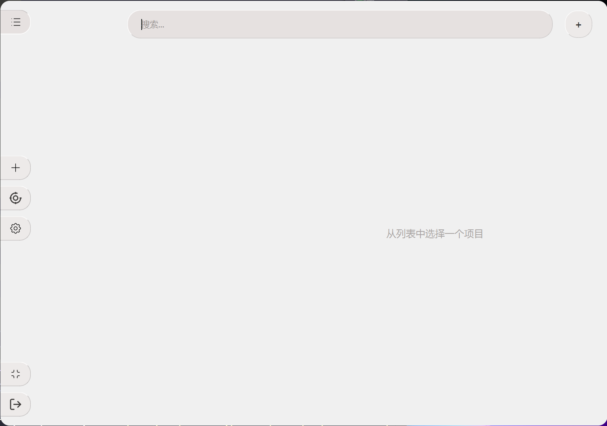
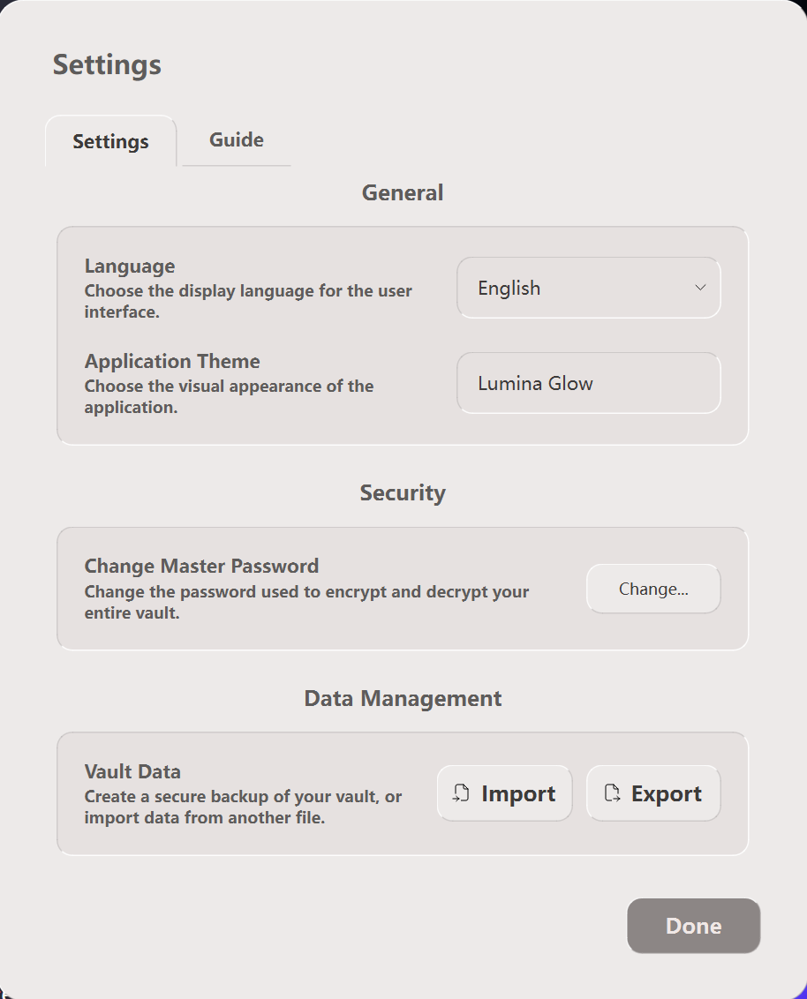

<h1 align = center>Oracipher(Oracle's Cipher)</h1>
<h2 align = center> - 一款安全的、本地优先的密码管理器</h2>
<p align=center>
    <a href="https://www.python.org/" title="Python"></a>
    <a href="https.www.python.org/downloads/" title="Python 3.10+"></a>
    <a href="https://t.me/+dHEs5v_mLfNjYjk0" title="Telegram"></a>
    <a href="https://www.riverbankcomputing.com/software/pyqt/" title="Framework PyQt6"></a>
    <a href="https://opensource.org/licenses/MIT" title="License MIT"></a>
    <a href="https://www.microsoft.com/windows" title="Platform Windows"></a>
    <a href="https://github.com/EldricArlo/Simple-Safekey/blob/10.4.1-version/CONTRIBUTING.md" title="Contributions welcome"></a>
</p>

<p align="center">
  
</p>

**Oracipher** 是一款使用 Python 和 PyQt6 构建的现代化、开源桌面密码管理器。它专为注重隐私和数据所有权的用户设计，所有数据均在本地通过行业领先的强加密算法进行加密存储，绝不上传到任何云端服务器。

---

## 目录

- [Oracipher(Oracle's Cipher) - 一款安全的、本地优先的密码管理器](#oracipheroracles-cipher---一款安全的本地优先的密码管理器)
  - [目录](#目录)
  - [预览](#-应用预览)
  - [✨ 核心优势](#-核心优势)
  - [⚖️ 优势与局限性](#️-优势与局限性)
  - [🔒 安全与隐私深度解析](#-安全与隐私深度解析)
      - [1. 您的主密码是唯一的钥匙](#1-您的主密码是唯一的钥匙)
      - [2. 数据加密流程](#2-数据加密流程)
      - [3. 数据存储位置](#3-数据存储位置)
      - [4. 安全实践](#4-安全实践)
  - [🛠️ 项目架构与代码逻辑](#️-项目架构与代码逻辑)
  - [🚀 快速开始](#-快速开始)
  - [📄 许可证](#-许可证)

---

## 应用预览

<p align="center">
  
  
  
  
</p>

---

## ✨ 核心优势

*   **绝对的隐私安全**：所有数据均在本地存储，您是您数据的唯一主人。应用不依赖任何云服务，也无需注册任何账户。
*   **军用级加密标准**：采用 **Argon2id** 进行密钥派生，有效抵抗GPU破解；使用 **AES-256 (GCM 模式)** 进行数据加密，确保数据的机密性和完整性。
*   **现代化的用户体验**：基于Qt6构建，拥有流畅的动画效果、美观的UI设计，并支持亮色与暗色两种主题。
*   **功能完备**：
    *   内置 **2FA/TOTP 动态口令生成器**，将您的密码和两步验证码安全地存放在一起。
    *   强大的**密码生成器**，可自定义密码的长度和字符集。
    *   灵活的**数据导入/导出**功能，支持安全的 `.skey` 加密格式备份，以及用于迁移的 `.csv` 和 `.txt` 格式。
*   **完全开源透明**：采用 MIT 许可证，所有代码均可被公开审计，确保没有任何后门和隐私隐患。
*   **跨平台运行**：基于 Python 和 Qt，理论上支持所有主流桌面操作系统 (Windows, macOS, Linux)。

---

## ⚖️ 优势与局限性

为了帮助您做出明智的决定，我们在此清晰地列出 SafeKey 的优势和当前存在的局限性。

| ✅ 优势 (Pros)                                                                 | ❌ 局限性 (Cons)                                                              |
| ------------------------------------------------------------------------------ | ------------------------------------------------------------------------------- |
| **本地优先，无云端**：您的数据永远不会离开您的电脑，从根本上杜绝了云服务数据泄露的风险。 | **无自动云同步**：无法在您的手机和电脑之间自动同步密码。您需要通过导出/导入 `.skey` 文件来手动同步。 |
| **一次性构建，永久免费**：作为一款开源软件，您无需支付任何订阅费用。         | **无浏览器集成**：目前没有浏览器扩展，无法在网页上实现密码的自动填充。    |
| **高度可定制和可审计**：您可以审查、修改甚至二次开发每一行代码。             | **无官方移动应用**：当前只有桌面版本。                                          |
| **不依赖任何第三方账户**：您只需要记住一个主密码，无需注册或依赖其他服务。   | **用户需自行负责备份**：因为数据存储在本地，您需要自己负责定期备份加密后的保险库文件。 |

---

## 🔒 安全与隐私深度解析

**这是 SafeKey 项目的基石，请您仔细阅读。**

#### 1. 您的主密码是唯一的钥匙

*   **绝对隐私**：您的**主密码**是解锁您保险库的**唯一钥匙**。它**永远不会**被存储在您的电脑上，也**永远不会**被发送到任何地方。
*   **零知识证明**：我们使用您的主密码和存储在本地的“盐值(salt)”通过 **Argon2id** 算法派生出一个加密密钥。我们只存储一个用该密钥加密过的“验证令牌”。当您解锁时，程序会用您输入的密码尝试解密这个令牌。如果成功，则证明密码正确。这个过程确保了即使有人拿到了您的整个数据文件，也无法在不知道主密码的情况下验证密码的正确性。
*   **无法恢复**：正因为我们不存储您的主密码，所以**我们无法为您恢复它**。请务必选择一个您能记住的、足够强壮的主密码。**一旦忘记，数据将永久无法解密。**

#### 2. 数据加密流程

*   **密钥派生 (Key Derivation)**：我们使用 **Argon2id** 算法。这是目前业界公认的最强的密钥派生函数之一，它是一种内存困难型算法，能有效抵抗来自 GPU 和 ASIC 的暴力破解攻击。
*   **数据加密 (Data Encryption)**：我们使用 **Fernet** 方案 (由 `cryptography` 库提供)。它在底层结合了：
    *   **AES-256 (CBC 模式)**：用于加密您的数据，确保机密性。
    *   **HMAC-SHA256**：用于验证数据的完整性。这可以防止您的加密数据被篡改（例如，注入恶意数据）。

#### 3. 数据存储位置

*   **完全本地化**：您的所有数据，包括加密后的数据库 (`safekey.db`)、盐值文件 (`salt.key`) 和验证文件 (`verification.key`)，都存储在您本地计算机的一个文件夹中（默认为 `safekey_data`）。
*   **无数据传输**：本应用程序**不会**将您的任何密码、用户名或其他保险库数据发送到互联网。唯一的网络活动是为您在条目中填写的网址（URL）获取网站图标（Favicon），这个过程是匿名的，不会发送任何可识别您身份或账户的信息。

#### 4. 安全实践

*   **安全剪贴板**：当您复制密码或2FA动态口令时，它们被视为敏感信息。SafeKey 会在30秒后自动从系统剪贴板中清除这些信息，以防止被恶意软件窥探。
*   **安全的备份格式**：我们强烈推荐使用 `.skey` 格式进行数据导出和备份。这是一个自包含的加密文件，其中包含了新的盐值和用您的主密码加密过的数据，可以安全地存储在任何地方。

---

## 🛠️ 项目架构与代码逻辑

SafeKey 采用了清晰的、分层的架构，以实现关注点分离 (SoC) 和高可维护性。

```
SafeKey/
│
├── core/                   # 核心业务逻辑 (独立于UI)
│   ├── crypto.py           # 加密/解密，主密码处理
│   ├── database.py         # SQLite数据库交互 (CRUD)
│   ├── data_handler.py     # 数据导入/导出 (skey, csv, txt)
│   ├── icon_fetcher.py     # 获取网站图标
│   └── icon_processor.py   # 图标处理 (圆形遮罩)
│
├── ui/                     # 所有用户界面 (PyQt6)
│   ├── components/         # 可复用的UI小部件 (如动画按钮, 2FA显示器)
│   ├── controllers/        # 控制器 (MVC中的C)，处理UI事件和业务逻辑
│   ├── dialogs/            # 各种对话框 (添加/编辑, 设置, 密码生成器)
│   ├── logic/              # 对话框内部的复杂逻辑 (如2FA, 图标管理)
│   ├── views/              # 主界面的主要视图 (侧边栏, 主内容区)
│   ├── assets/             # 静态资源 (图标, 样式表)
│   ├── task_manager.py     # 全局后台任务管理器
│   └── theme_manager.py    # 主题管理 (亮/暗)
│
├── utils/                  # 通用工具模块
│   ├── clipboard.py        # 安全剪贴板管理器
│   ├── icon_cache.py       # 图标缓存，防止UI卡顿
│   └── paths.py            # 处理资源路径 (兼容打包)
│
├── language/               # 国际化 (i18n)
│   ├── locales/
│   │   ├── en.py           # 英语翻译
│   │   └── zh_CN.py        # 中文翻译
│   └── manager.py          # 语言管理器
│
├── .env.example            # 环境配置文件
├── app.py                  # 主应用窗口容器 (QMainWindow)
├── main.py                 # 程序入口点
├── config.py               # 应用配置管理
└── requirements.txt        # 项目依赖
```

**逻辑流程:**
1.  **`main.py`**: 程序启动，设置日志，加载配置，并实例化 `app.py` 中的 `SafeKeyApp`。
2.  **`app.py`**: 作为主窗口容器，它首先显示 `UnlockScreen`。它还负责管理 `DataManager` (数据库) 和 `CryptoHandler` (加密) 的实例。
3.  **`UnlockScreen`**: 处理用户的解锁或首次设置密码。成功后，它会发出一个信号。
4.  **`SafeKeyApp`**: 接收到解锁信号后，它会隐藏 `UnlockScreen` 并显示 `MainWindow`。
5.  **`MainWindow`**: 是主界面的根，它创建了 `SidebarView` 和 `MainContentView`，并将它们交给 `MainWindowController` 进行管理。
6.  **`MainWindowController`**: 这是UI的“大脑”。它从 `DataManager` 获取数据，处理所有用户的点击和输入事件，并相应地更新 `SidebarView` 和 `MainContentView` 的显示内容。
7.  **`core/`**: 所有的后台操作（如加解密、数据库读写、文件导入导出）都由 `core` 包中的模块负责，控制器通过调用它们来完成任务。
8.  **`TaskManager`**: 对于所有耗时操作（如网络请求、大文件导入、密码更改），控制器都会使用 `TaskManager` 将它们放入后台线程执行，以防止UI冻结。

---

## 🚀 快速开始

1.  **克隆仓库**
    ```bash
    git clone https://github.com/your-username/SafeKey.git
    cd SafeKey
    ```

2.  **创建虚拟环境** (推荐)
    ```bash
    python -m venv .venv
    # Windows
    .venv\Scripts\activate
    # macOS / Linux
    source .venv/bin/activate
    ```

3.  **安装依赖**
    ```bash
    pip install -r requirements.txt
    ```

4.  **运行程序**
    ```bash
    python main.py
    ```

---

## 📄 许可证


本项目采用 MIT 许可证,详情请见 [LICENSE](LICENSE) 文件


