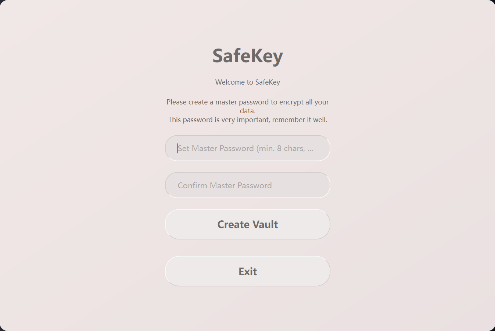
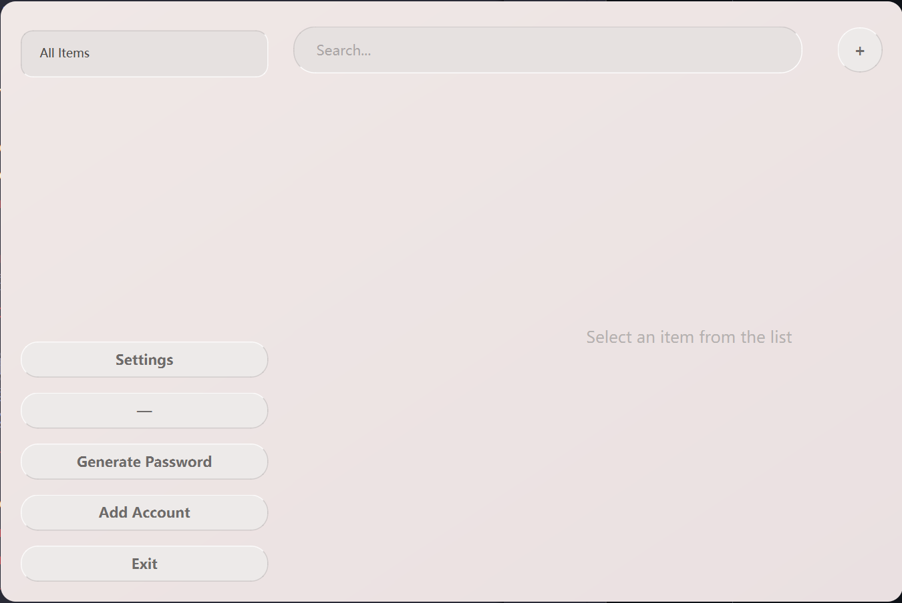

# SafeKey 密码管理器

[](https://opensource.org/licenses/MIT)
[](https://www.python.org/downloads/)
[](CONTRIBUTING.md)

**一款基于 Python 和 PyQt6 构建的现代化、安全且界面美观的本地密码管理器。**

SafeKey 致力于提供一个纯粹的、离线的密码管理解决方案。您的所有数据都经过强大的行业标准算法加密，并仅存储在您自己的计算机上，确保了最高级别的隐私和安全。

---

## 🌟 核心功能

*   **端到端加密:** 所有数据在保存前均使用您的主密码通过 AES-256-GCM 进行加密。
*   **本地优先:** 您的密码保险库永远不会离开您的设备，没有任何云同步或网络连接。
*   **强密码生成器:** 内置可定制的密码生成器，帮助您创建高强度的随机密码。
*   **现代化UI:** 采用柔和、干净的“新拟态”（Neumorphism）设计风格，提供卓越的视觉体验。
*   **搜索与分类:** 通过分类和即时搜索功能，快速找到您需要的账户信息。
*   **安全剪贴板:** 复制的密码会在30秒后自动从系统剪贴板中清除，防止泄露。
*   **跨平台:** 基于 PyQt6 构建，理论上可在 Windows, macOS, 和 Linux 上运行。
*   **多语言支持:** 支持语言切换（当前内置英语和简体中文）。

## 📸 软件截图




## 🛠️ 技术栈与依赖

*   **编程语言:** Python 3.8+
*   **GUI 框架:** PyQt6
*   **加密库:** `cryptography` (提供了 Fernet 对称加密)
*   **数据库:** SQLite 3 (通过 Python 内置的 `sqlite3` 模块)
*   **样式:** QSS (Qt Style Sheets)，实现了自定义的UI主题
*   **依赖管理:** `requirements.txt`

## 🚀 开始使用

请按照以下步骤在您的本地计算机上安装并运行 SafeKey。

### 先决条件

*   Python 3.8 或更高版本
*   Git

### 安装步骤

1.  **克隆仓库**
    ```bash
    git clone https://github.com/your-username/SafeKey.git
    cd SafeKey
    ```

2.  **创建并激活虚拟环境** (强烈推荐)

    *   **Windows:**
        ```cmd
        python -m venv venv
        .\venv\Scripts\activate
        ```
    *   **macOS / Linux:**
        ```bash
        python3 -m venv venv
        source venv/bin/activate
        ```

3.  **安装所有依赖项**
    `requirements.txt` 文件包含了所有必需的 Python 包。
    ```bash
    pip install -r requirements.txt
    ```
    *重要提示:* `PyQt6-SVG` 包是必需的，用于正确显示界面中的 SVG 图标。

4.  **运行应用程序**
    ```bash
    python main.py
    ```

### 首次使用

首次运行程序时，您将被引导进入“设置模式”，需要创建一个主密码。这个密码至关重要，它是您访问所有数据的唯一钥匙。**请务必牢记，一旦丢失将无法恢复！**

## 🔐 安全模型

SafeKey 的安全性是其设计的核心。我们采用了多层保护措施来确保您的数据安全。

1.  **主密码:**
    您的主密码是唯一的访问凭证。它**不会**以任何形式被存储。

2.  **密钥派生 (KDF):**
    我们使用 **PBKDF2-HMAC-SHA256** 算法从您的主密码中派生出加密密钥。
    *   **盐 (Salt):** 每个保险库都会生成一个唯一的、16字节的随机盐，与您的主密码结合，有效抵抗彩虹表攻击。
    *   **迭代次数:** 我们设置了高达 **600,000** 次的迭代，这极大地增加了暴力破解的难度和时间成本。

3.  **数据加密:**
    所有敏感数据（用户名、密码、备注等）都使用派生出的密钥通过 **AES-256-GCM** 算法进行加密。`cryptography.fernet` 保证了加密和认证的完整性。

4.  **本地存储:**
    加密后的数据库文件 (`safekey.db`)、盐文件 (`salt.key`) 和验证文件 (`verification.key`) 都存储在您本地的 `safekey_data` 目录中。

## 📂 项目结构

项目代码结构清晰，遵循关注点分离原则，易于理解和维护。

```
SafeKey/
├── main.py                 # ✅ 应用主入口，初始化日志和语言
├── app.py                  # 🖼️ 主应用窗口 (QMainWindow)
├── config.py               # ⚙️ 配置文件加载/保存逻辑
├── language.py             # 🌐 国际化语言管理器
├── style.qss               # 🎨 全局背景样式
├── requirements.txt        # 📦 Python依赖列表
├── README.md               # 📖 你正在阅读的文件
│
├── core/                   # --- 核心后端逻辑 ---
│   ├── crypto.py           # 🔑 加密/解密核心
│   └── data_manager.py     # 🗄️ 数据库交互逻辑
│
├── ui/                     # --- 用户界面 ---
│   ├── app_ui.qss          # 💅 统一UI组件样式
│   ├── main_interface.py   # 🖥️ 主功能界面
│   ├── unlock_screen.py    # 🚪 解锁/设置密码界面
│   │
│   └── dialogs/            # 💬 所有对话框窗口
│       └── ...
│
└── logs/                   # 📜 (自动创建) 存放日志文件的目录
```

## 🌐 国际化 (i18n)

应用程序的国际化由 `language.py` 文件中的 `LanguageManager` 类处理。

*   **添加新语言:**
    1.  在 `LanguageManager` 的 `TRANSLATIONS` 字典中，仿照 `'en'` 和 `'zh_CN'` 的结构，添加一个新的语言代码和对应的翻译字典。
    2.  在 `get_available_languages` 方法中添加新语言的显示名称。
*   **应用翻译:**
    在代码中，使用 `from language import t` 导入全局翻译实例，然后通过 `t.get('translation_key')` 来获取文本。

## 🤝 如何贡献

我们欢迎任何形式的贡献！无论是提交 Bug 报告、提出功能建议还是发送 Pull Request。

1.  **Fork** 本仓库。
2.  创建一个新的分支 (`git checkout -b feature/AmazingFeature`)。
3.  进行您的修改。
4.  提交您的更改 (`git commit -m 'Add some AmazingFeature'`)。
5.  将您的分支推送到远程仓库 (`git push origin feature/AmazingFeature`)。
6.  打开一个 **Pull Request**。

## 📜 许可证

本项目采用 [MIT 许可证](LICENSE.txt)授权。详情请参阅 `LICENSE.txt` 文件。


